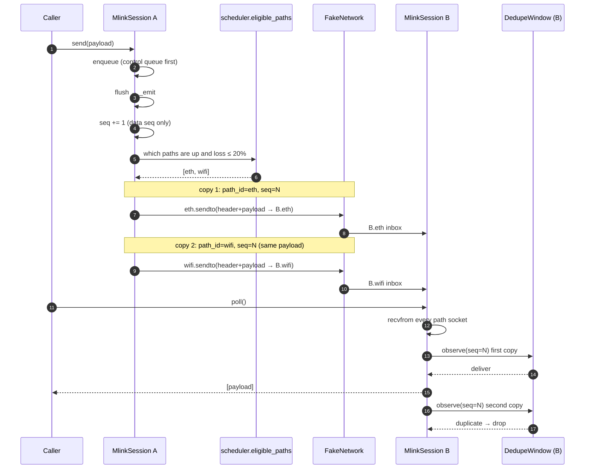
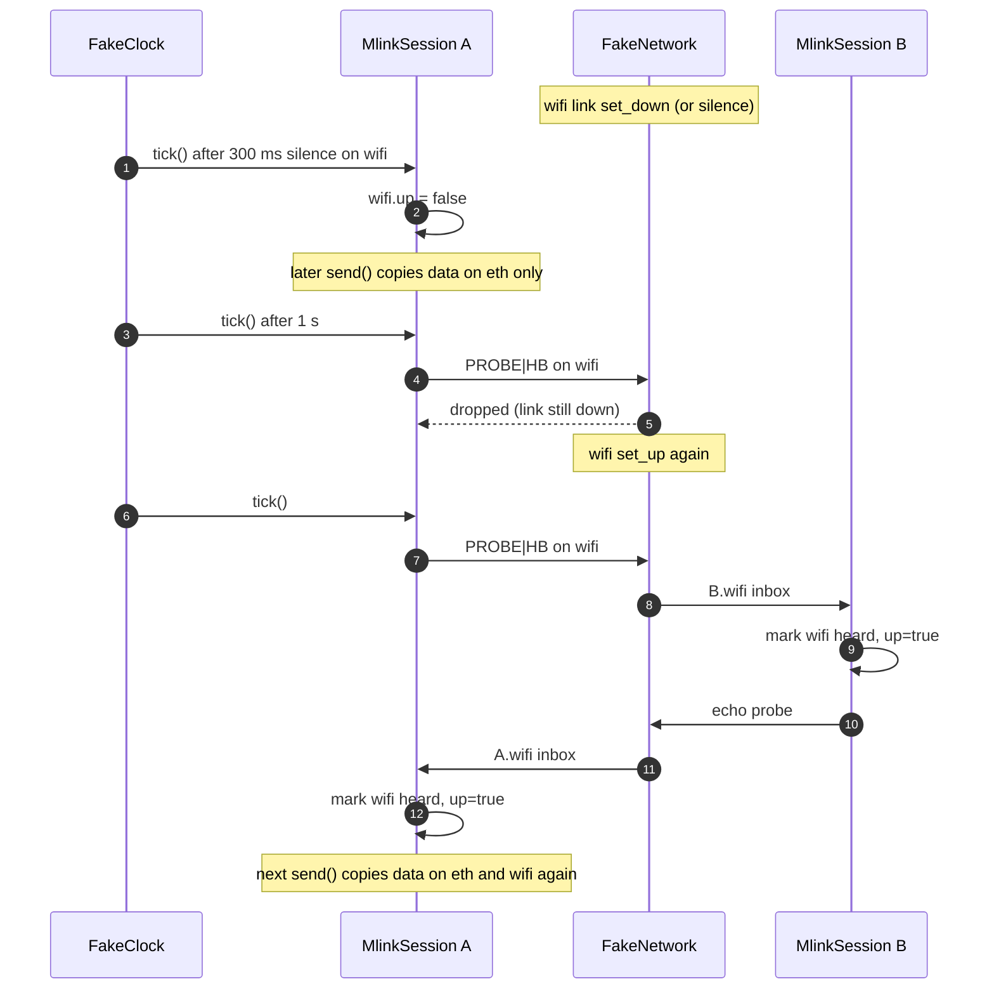
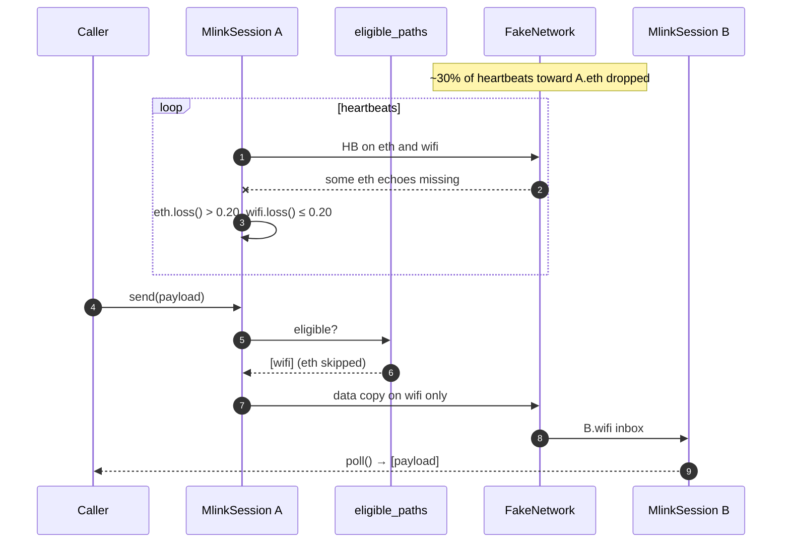

# Stage 1 sequence (protocol library)

Stage 1 is **not** client/server processes. It is one shared Python
module (`mlink-transport/proto/`). Tests create two `MlinkSession`
objects (A and B) on the same process and wire them through
`FakeNetwork` (in-memory UDP). Later, `mlink-op` and `mlink-edge`
will each own one session and import this same module.

Default lab picture used below: two paths, `eth` and `wifi`.

```text
pytest / caller
   │
   ├── MlinkSession A          MlinkSession B
   │     path eth  ──────────►   path eth
   │     path wifi ──────────►   path wifi
   │              FakeNetwork
```

---

## 1. App datagram: copy on every live path, first-good wins

Same payload, same `session` + `seq`, different `path_id`. B delivers
the first good copy and drops the rest. No reorder hold.



If `wifi` is marked down or its loss is over the threshold, `_emit`
never sends a data copy on wifi. Eth still delivers.

---

## 2. Heartbeat and RTT (not delivered to the app)

Every 100 ms, each **up** path sends a heartbeat. Heartbeats use a
per-path counter, not the data `seq`. The peer echoes the original
timestamp; the sender measures RTT. Echoes are not re-echoed.

```mermaid
sequenceDiagram
    autonumber
    participant Clock as FakeClock
    participant A as MlinkSession A
    participant Net as FakeNetwork
    participant B as MlinkSession B

    Clock->>A: tick()  (advance ≥ 100 ms)
    A->>A: path eth still up
    A->>Net: HB(path=eth, hb_seq=k, ts=T)
    Net->>B: B.eth inbox

    Note over B: poll() — not app data
    B->>B: mark eth heard, up=true
    B->>B: observe_heartbeat(k)
    B->>Net: echo(HB|ECHO, seq=k, ts=T)
    Net->>A: A.eth inbox

    A->>A: poll()
    A->>A: observe_rtt(now - T)
    Note over A,B: payload is empty; nothing returned to the caller
```

Same exchange runs independently on wifi.

---

## 3. Path down, then probe brings it back

No data or heartbeat on a path for 300 ms → mark down, stop data
copies there, probe at 1 Hz. A heard probe/heartbeat marks the path
up again.



---

## 4. Lossy path excluded from data (still heartbeats)

Scheduler v1: data copies go to every path that is **up** and
`loss ≤ 0.20`. Loss is inbound heartbeat loss over the last 20
heartbeats. A lossy-but-up path still gets heartbeats; it does not
get app payloads.



---

## What this is not

No `mlink-op` / `mlink-edge` processes, no real UDP, no app-facing
`127.0.0.1` sockets. Those appear in Stage 2: two OS processes, each
holding one `MlinkSession`, talking over real localhost UDP.
