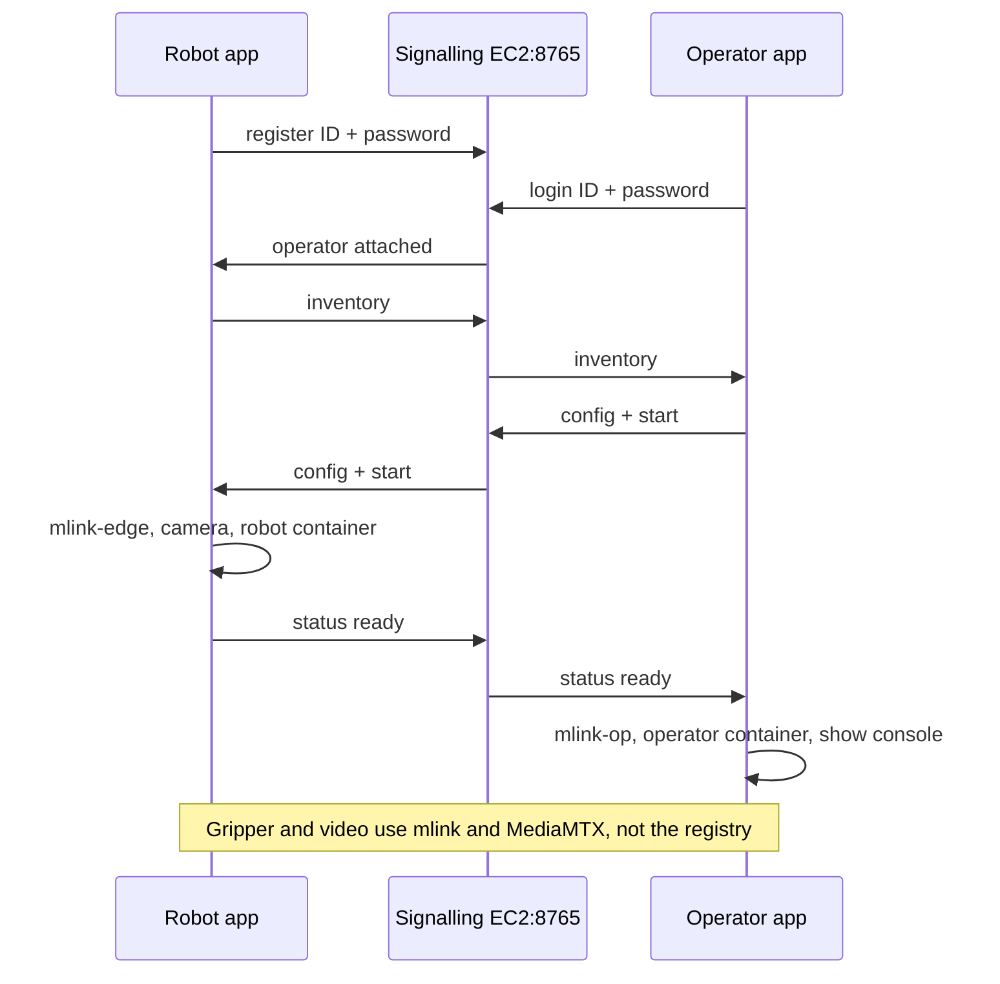

# Packaging architecture

The operator becomes an installable Ubuntu desktop app. The robot
side is a terminal process started over SSH, because that machine
is reached by Tailscale and does not need a local display. A small
registry on the existing EC2 host pairs them with the ID and password
printed by the robot terminal. After the operator confirms the link
and the devices, each side starts the processes this repo already uses.

Read `packaging/IMPLEMENTATION.md` for the milestones. This file is
the picture those milestones implement.

---

## Machines this design is for

Checked 2026-09-28. Addresses move with DHCP. Apps discover them at
runtime. Do not hardcode the IPs below into the desktop apps.

| Role | Host | OS | Workspace |
| --- | --- | --- | --- |
| Operator | this PC, `pure-dev-muhammadhassan`, Tailscale `100.95.150.54` | Ubuntu 22.04, Python 3.10 | `/home/muhammadhassan/robots` |
| Robot | `muhammad-osama@100.120.193.52`, hostname `AUTOOS-DEV-MUHAMMADOSAMA` | Ubuntu 24.04.4 | `/home/muhammad-osama/teleops_hassan` |
| Registry, coturn, ICE signalling | `ec2-user@ec2-3-227-234-95.compute-1.amazonaws.com` | Amazon Linux 2023, Python 3.9 | `~/turn`, coturn in `~/coturn` |

Operator internet NIC: `wlo1` (`192.168.222.56` via `192.168.222.1`).
`enx00e04c681cc3` is down. `tailscale0` is `100.95.150.54`.

Robot internet NIC: `wlp0s20f3` (`10.255.254.58`). Onboard `enp0s31f6`
is down. USB ethernet `enx00e04c2c4570` is up at `10.10.10.1/24` and
has no default route. `tailscale0` is `100.120.193.52`.

Arm buses on the robot: follower `/dev/ttyACM0` via
`/dev/serial/by-id/usb-1a86_USB_Single_Serial_5B61033180-if00`,
leader `/dev/ttyACM1` via `…5B3E090040…`. The leader stays unused.
Gripper camera: `/dev/video2` (`USB2.0_CAM1`). Integrated camera:
`/dev/video0`. `/dev/video1` and `/dev/video3` are metadata nodes.

---

## Current model

The operator is Chrome on this PC. The robot PC in Dubai owns the
SO-ARM101. mlink carries gripper control. The two PCs choose the mlink
path at startup:

- Tailscale: `mlink-transport/scripts/start_daemon.sh op|edge --remote-laptop`
- TURN: `mlink-transport/scripts/start_daemon.sh op|edge --ice`

The script accepts one of those flags. Passing both is an error.
Default with neither flag is the Orin Ethernet-plus-Wi-Fi YAML, which
is not the Dubai laptop path.

```text
OPERATOR PC (Ubuntu 22.04)                         ROBOT PC (Ubuntu 24.04, Dubai)
Chrome  http://127.0.0.1:8090/                     SO-ARM101 follower /dev/ttyACM0
  keyboard g/h, HUD                                gripper camera /dev/video2
        |                                            |
operator backend (Compose)                         robot container (Compose, --real-arm)
  HTTP + WebSocket :8090                           safety watchdog, Feetech id 6
        | UDP 127.0.0.1:5501/5502                    | UDP 127.0.0.1:5503/5504
     mlink-op                                    mlink-edge
        |                                            |
        +---- one WAN path, chosen at start --------+
              Tailscale (tailscale0, ~40 ms)
              or TURN (coturn 3.227.234.95, ~200–400 ms)

Camera, separate from mlink:
  robot MediaMTX  TCP :8889  page /cam/
  Chrome loads that page from the Tailscale address
  (or from a forwarded public TCP 8889)

EC2
  coturn UDP 3478, relay UDP 50000–50100     used only for the TURN link
  ICE signalling TCP 8765                    ICE agents, and desktop login
Tailscale
  SSH and the camera page                    also the Tailscale mlink path
```

Bring-up today is manual, and the order matters. Coturn and ICE
signalling are already up when the link is TURN. Then the robot
mlink daemon, then the operator mlink daemon, then
`video/start.sh` on the robot, then
`start_robot_mlink.sh --real-arm`, then
`start_operator_mlink.sh --remote-laptop`. Closing the operator side
first is what torque-offs the gripper (500 ms watchdog).

The browser never speaks ROS and never opens the WAN sockets. ROS
stays on localhost (CycloneDDS). mlink is the WAN pipe.

Two trees on the robot differ from this git checkout:

- `video/start.sh` in git is the Orin encoder (`nvv4l2h264enc`,
  `/dev/video0`). The Dubai laptop runs a different launcher:
  MediaMTX, `x264enc`, `DEVICE` default `/dev/video2`, page on
  `:8889`. That launcher is not the git file.
- Serial and camera paths are fixed in the Compose overlay
  (`/dev/ttyACM0`) and in the laptop camera script.

`listen_media` is unset. Camera RTP does not ride the mlink socket.
TURN changes gripper control only.

---

## New model

A robot terminal and one operator desktop app. The registry lets
them find each other from behind two NATs.

```text
  ROBOT PC (SSH over Tailscale)                    OPERATOR PC
  +---------------------------+                    +-----------------------------+
  | teleop-robot              |                    | teleop-operator             |
  | terminal: ID + password   |                    | window: ID + password       |
  | then status lines         |                    | then config, then console   |
  | no Qt, no display         |                    | the only GUI                |
  +-------------+-------------+                    +-------------+---------------+
                | outbound                                     | outbound
                v                                              v
                         EC2 signalling  TCP 8765
                         ICE candidates, and desktop login
                         pair ID + password
                         relay inventory / config / start / stop
                         does not carry gripper bytes or video

  After Start, each app launches the existing local stack.
  Gripper bytes go operator ↔ robot on the chosen link.
  They do not go through the registry.

        teleop-operator                         teleop-robot
        start mlink-op                          start mlink-edge
        start operator Compose                  start camera (chosen /dev/videoN)
        show http://127.0.0.1:8090              start robot Compose (chosen serial)
                \                                      /
                 +---------- mlink WAN ----------------+
                    Tailscale   or   TURN (coturn)
                 camera page stays MediaMTX on the robot
```

Why a server sits in the middle of login: the operator cannot open a
TCP connection to the robot. Both machines are behind NAT, and the
robot's public port changes per destination. Both apps connect
outbound to EC2. The registry checks the password and forwards the
small JSON session (device list, config, start, stop). Once Start
succeeds, gripper traffic is the existing mlink path between the two
PCs. A dropped registry connection does not stop a session that has
already started. An explicit Stop, or closing the operator window,
does.

Login is not a new port and not a new EC2 service. The process
already listening on TCP 8765 accepts two kinds of client. An ICE
agent sends `join` and exchanges candidates, as it does today. The
robot terminal sends `register`. The operator app sends `login`.
That same process forwards the inventory, config, and start messages. Coturn is the
other service, on UDP 3478, and it is used only when the operator
picks TURN.

Ports on this EC2 host, checked 2026-09-28:

| Service | Port | Reachable from this PC |
| --- | --- | --- |
| ICE signalling and desktop login | TCP 8765 | yes, process listening |
| coturn STUN/TURN | UDP 3478 | yes |
| coturn relay pool | UDP 50000–50100 | yes for UDP; TCP to 50000, 50001, 50050, 50099, and 50100 times out |
| spare idea TCP 8766 | TCP 8766 | no |
| T6 alternate STUN | UDP 3479 | coturn answers STUN there today; packaging does not use it |

Nothing in 50000–50100 was listening at check time. Coturn does not
hold those UDP ports until a TURN client allocates one, and its
range is the whole block (`--min-port=50000 --max-port=50100`).
The security group for that block is UDP. A WebSocket cannot bind
there. Parking login on one of those numbers would also take a port
away from the next relay allocation.

UDP 3479 is not a second coturn. The one coturn process answers an
extra STUN port because that is how this build behaves, and T6 used
it once to classify NAT. Packaging does not listen on 3479, and it
does not need that port left open.

8766 was only an unused number from the first draft. Nothing is
gained by opening it. The EC2 listeners for this product stay the
two that are already up: TCP 8765 and UDP 3478, plus the UDP relay
range coturn allocates from.

---

## Session flow

```text
1. Install teleop-robot on the robot PC. Over SSH, start
   `python3 -m packaging.robot_app`.
2. The terminal prints a 9-digit ID and an 8-character password
   and registers them with the registry. Read them from that SSH
   session.
3. Install teleop-operator on the operator PC. Launch the window.
4. Type that ID and password. The registry attaches the two sides.
5. The robot sends its inventory: network interfaces, serial
   adapters, capture devices, and the camera page URL.
6. The operator window shows the config page. The operator picks
   values and presses Start.
7. The robot starts its processes and reports progress.
8. When the robot reports ready, the operator starts its processes.
9. The operator window shows the existing console
   (http://127.0.0.1:8090/) inside the desktop app.
10. Keys g and h move the gripper the same way they do today.
    Stop and Logout stay visible on the console. Stop brings both
    sides down and leaves the login in place, so Start can run
    again with the same config. Logout brings both sides down and
    returns to the login page. Closing the window does the same
    cleanup as Stop, then exits.
```



---

## What the operator sees

Three pages in one window.

**Login.** ID and password from the robot SSH terminal. Wrong
password stays on this page. A second operator attaching to the
same ID is rejected while the first is attached.

**Config, after login.** This is the page to get right. The
suggestion below is the layout P4 implements.

**Console, after Start.** The existing operate page at
`http://127.0.0.1:8090/`, inside the window (Qt WebEngine). Keyboard
g/h, the HUD, and the camera view stay the ones the web console
already has. Packaging does not rewrite `operate.js`.

The robot has no window. Its SSH terminal prints the ID, the
password, and a status line (waiting, operator attached, starting,
running, stopped, error). `n` prints a new password and registers
again. It lists the inventory it published so the person at that
session can see which serial port and camera were selected. It does
not ask them to approve Start a second time. The operator's Start
is the confirmation. The terminal prints the chosen values as soon
as they arrive, before processes are spawned, so someone at the arm
can stop the process if the selection is wrong.

---

## Suggestion for the config page

The request names two dropdowns and also names two ways to run mlink
(TURN or Tailscale). Those are different choices. Putting Tailscale
and TURN into the interface dropdowns would hide the real network
cards and would bond an overlay to the same Wi-Fi.

Recommended layout, and the one the milestones implement:

1. **Link**, two radio buttons, one required.
   - **Tailscale.** Starts `start_daemon.sh` with `--remote-laptop`
     on both sides. Last lab heartbeat was about 37–42 ms. Both PCs
     are already on the tailnet. Camera page is the robot's
     Tailscale URL (`http://100.120.193.52:8889/cam/` on this robot).
   - **TURN.** Starts `start_daemon.sh` with `--ice` on both sides.
     Coturn and ICE signalling on EC2 must already be up. Last lab
     heartbeat was about 390–400 ms, and the gripper felt about
     200 ms via Virginia against about 20 ms on Tailscale. Video
     stays on the robot MediaMTX page. TURN does not carry the
     camera in this packaging slice.

2. **Two interface dropdowns on the robot's physical NICs.**
   - **Interface 1**, required. Default is the NIC of
     `ip route get 1.1.1.1` (robot `wlp0s20f3` today). For TURN, that
     NIC's IPv4 becomes `bind_ip` in a generated ICE yaml. For
     Tailscale, mlink still binds `tailscale0`; Interface 1 is the
     underlay the window records.
   - **Interface 2**, optional. Default **None**.
   - Offer real NICs only. Hide `lo`, `tailscale0`, `docker0`,
     bridge interfaces, and virtual Ethernet. A NIC with no default
     route (the robot's `enx00e04c2c4570` at `10.10.10.1`) may appear
     under Interface 2 labeled local-only. It cannot be Interface 1.
   - The operator PC's internet NIC is a read-only line
     ("Operator network: wlo1"). This PC has one internet NIC, so a
     second operator dropdown would only repeat it.

3. **Arm** and **Video**, dropdowns filled from the robot inventory.
   - Arm labels use the stable `/dev/serial/by-id/…` name and show
     the current `ttyACM` it points at. Default the follower
     `…5B61033180…` when it is present. The leader
     `…5B3E090040…` is listed and is not the default.
   - Video lists capture nodes, with the sysfs card name. Skip
     metadata nodes. Default the node named `USB2.0_CAM1`
     (`/dev/video2` today). `/dev/video0` is the integrated camera
     and is not the default.

**What Start does with Interface 2 in this slice.** Start proceeds
when Interface 2 is None. Start is refused, with the reason on the
status line, when Interface 2 is set. mlink can already duplicate
datagrams across Ethernet and Wi-Fi on the Orin YAML, and that mode
is a third path beside `--remote-laptop` and `--ice`. The Dubai
robot does not have a second internet uplink (onboard Ethernet is
down; the USB ethernet is a local `10.10.10.1` network). Bonding
that pair is a later change. The dropdown is on the page so the
choice exists, and the app will not pretend the second NIC is in
the session.

---

## What Start launches

Robot, in this order, after it receives `start`:

| Step | Tailscale | TURN |
| --- | --- | --- |
| 1 | `start_daemon.sh edge --remote-laptop` | `start_daemon.sh edge --ice` with generated `bind_ip` from Interface 1 |
| 2 | SO-ARM camera launcher, `DEVICE` = the chosen capture node | same |
| 3 | `start_robot_mlink.sh --real-arm` with the chosen serial port | same |

Operator, only after the robot reports ready:

| Step | Tailscale | TURN |
| --- | --- | --- |
| 1 | `start_daemon.sh op --remote-laptop` | `start_daemon.sh op --ice` with this PC's default-route IPv4 as `bind_ip` |
| 2 | `start_operator_mlink.sh` gripper-only, camera URL from the robot inventory | same camera URL |
| 3 | Load `http://127.0.0.1:8090/` in the window | same |

Stop runs the operator stack down first, then the robot stack
(container, mlink daemon, camera). That is the torque-off order:
operator heartbeats end, the 500 ms watchdog releases the gripper,
then the robot container, mlink-edge, and the camera stop. The
Stop and Logout buttons stay on screen after the console replaces
the config page. Logout also detaches this operator. The robot
terminal keeps its ID and password, so a later login can attach
again.

Generated ICE yaml is a runtime copy of the gitignored
`turn/config/local_op.yaml` and `local_edge.yaml` with `bind_ip`
replaced. The app does not edit the lab YAML in git, and it does
not write a Tailscale `100.x` address into `bind_ip`.

---

## Installable packages

Two Debian packages, both amd64:

| Package | Installs on | What the user runs |
| --- | --- | --- |
| `teleop-robot` | Ubuntu 24.04 robot PC | Terminal over SSH. No GUI. |
| `teleop-operator` | Ubuntu 22.04 operator PC | Login, config, console |

Each installs under `/opt/teleop` and uses distro Python. The robot
package does not depend on Miniforge or PyQt. The operator package
is the only one with a desktop launcher, and it includes Qt
WebEngine so the console renders inside the app.

The packages do not contain the `ros2-teleop-poc:humble` image
(about 3 GB) or a prebuilt `ros2_ws`. Those stay on the machine the
way they are today. The Start button checks for Docker and the
image and shows a plain error when they are missing. MediaMTX is
gitignored; the robot package build copies `video/bin/mediamtx`
into the package when that file is on the build machine.

On EC2 the login handlers run inside the signalling process that
already owns TCP 8765. The desktop packages do not include that
process. Amazon Linux has no `.deb` install of these apps.

---

## Boundaries

- Gripper motion, safety clamping, and the 500 ms watchdog stay in
  the existing robot container. The operator app and the robot
  terminal spawn that container. They do not publish
  `/gripper_safe` themselves.
- Joints 1–5, MoveIt Servo, and a second camera stay out.
- Video-through-mlink stays out. `listen_media` stays unset.
- Orin `lab-op.yaml` and `lab-edge.yaml` stay as they are.
- TURN password, registry session passwords, and `coturn.env` stay
  out of git.
- TCP 8765 stays the only signalling port. Login messages share
  that process with ICE. Coturn stays UDP 3478, with relay
  allocations on UDP 50000–50100. Packaging does not listen on
  8766, on 3479, or inside the relay range.
- A packaging session does not start the paused TURN milestones
  T7–T10.
